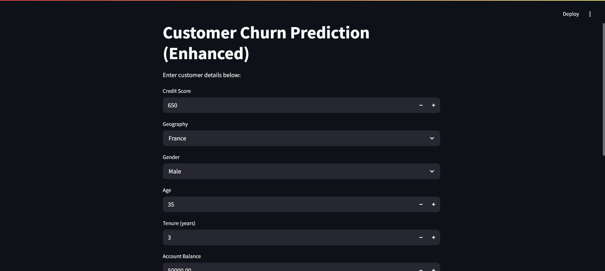
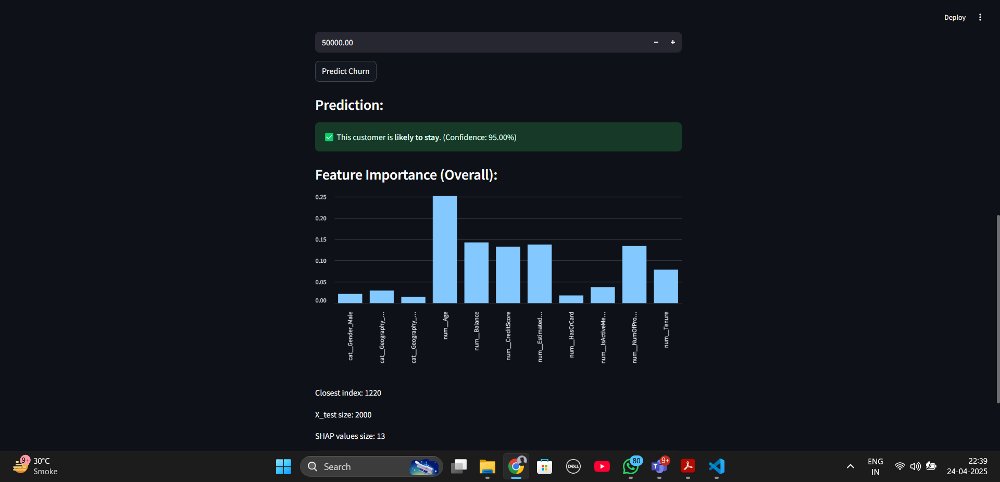

# 📊 Customer Churn Prediction App

This is a web application built with **Streamlit** that predicts whether a customer is likely to churn based on historical data. It includes SHAP value interpretation, CSV export, and retraining features.

---

## 🚀 Getting Started

### ✅ Step 1: Clone the repository

```bash
git clone https://github.com/INCREDIBLE18/churn-prediction-app.git
cd churn-prediction-app
```

---

### ✅ Step 2: Create and activate virtual environment

```bash
# For Windows
python -m venv venv
venv\Scripts\activate

# For Linux/macOS
python3 -m venv venv
source venv/bin/activate
```

---

### ✅ Step 3: Install dependencies

```bash
pip install -r requirements.txt
```

---

### ✅ Step 4: Run the Streamlit App

```bash
streamlit run customer_churn_prediction.py
```

---

## 🧠 Features

- Predict customer churn with trained ML model
- Visualize SHAP values for explanation
- Retrain model with uploaded dataset
- Download prediction results as CSV

---

## 📸 Screenshots

### 🖼️ Home Page


### 🖼️ SHAP Explanation


---

## 🧰 Tech Stack

- Python
- Streamlit
- Pandas, scikit-learn, SHAP

---

## 📜 License

This project is open-source and available under the [MIT License](LICENSE).

---

> Made with ❤️ by [Deepak Gavhane](https://github.com/INCREDIBLE18)
